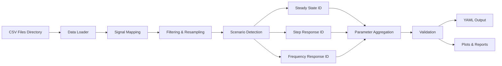

# Product Requirements Document (PRD)
# Lateral System Identification Tool

## 1. Executive Summary

본 문서는 차량 횡방향 동역학 시스템 식별을 위한 통합 도구의 설계 및 구현 요구사항을 정의합니다. 이 도구는 MORAI 시뮬레이터에서 수집된 여러 CSV 파일을 자동으로 처리하여 차량의 동역학 파라미터를 추정하고, MPC 제어기 설계에 필요한 모델 파라미터를 산출합니다.

### 핵심 목표
- **통합 데이터 처리**: 디렉토리 내 모든 CSV 파일을 자동으로 읽고 처리
- **시나리오별 최적화**: 정상상태, 스텝, 스윕 각 시나리오에 특화된 식별 알고리즘
- **자동화된 파이프라인**: CSV 입력부터 파라미터 출력까지 완전 자동화
- **품질 보증**: 데이터 검증, 이상치 제거, 신뢰도 평가 포함

## 2. 시스템 아키텍처

### 2.1 전체 구조
```
lateral_system_identification/
├── src/
│   ├── __init__.py
│   ├── io/
│   │   ├── __init__.py
│   │   ├── csv_loader.py          # CSV 파일 로드 및 검증
│   │   └── data_aggregator.py     # 여러 CSV 통합 처리
│   ├── preprocessing/
│   │   ├── __init__.py
│   │   ├── signal_mapping.py      # 신호 매핑 및 단위 변환
│   │   ├── filtering.py           # 필터링 및 리샘플링
│   │   └── segmentation.py        # 시나리오별 세그먼트 추출
│   ├── identification/
│   │   ├── __init__.py
│   │   ├── steady_state_id.py     # 정상상태 식별 (Kv)
│   │   ├── step_response_id.py    # 스텝 응답 식별 (Iz, Caf, Car)
│   │   └── frequency_id.py        # 주파수 응답 식별
│   ├── validation/
│   │   ├── __init__.py
│   │   ├── model_validator.py     # 모델 검증
│   │   └── quality_metrics.py     # 품질 지표 계산
│   ├── reporting/
│   │   ├── __init__.py
│   │   ├── yaml_exporter.py       # YAML 출력
│   │   └── plot_generator.py      # 시각화
│   └── cli/
│       ├── __init__.py
│       └── main.py                # CLI 인터페이스
├── config/
│   ├── vehicle_params.yaml        # 차량 기본 파라미터
│   └── processing_config.yaml     # 처리 설정
├── tests/
├── requirements.txt
└── README.md
```

### 2.2 데이터 플로우


## 3. 입력 사양

### 3.1 CSV 파일 구조
```python
REQUIRED_COLUMNS = {
    'timestamp': float,                    # Unix timestamp
    'steer_cmd': float,                    # [rad] 조향 명령
    'steering_angle_deg': float,           # [deg] 실제 조향각
    'true_velocity_x': float,              # [m/s] 종방향 속도
    'imu_accel_y': float,                  # [m/s²] 횡방향 가속도
    'yaw_rate': float,                     # [rad/s] 요 레이트
    'scenario_type': str,                  # 시나리오 타입
    'scenario_step': int,                  # 시나리오 스텝
    'scenario_time': float,                # 시나리오 시간
    'is_steady_state': bool                # 정상상태 플래그
}

OPTIONAL_COLUMNS = {
    'x_position': float,
    'y_position': float,
    'gps_latitude': float,
    'gps_longitude': float,
    'estimated_velocity_y': float
}
```

### 3.2 디렉토리 구조
```
data_directory/
├── *_steady_state_cornering.csv
├── *_step_steer.csv
└── *_sine_sweep.csv
```

## 4. 신호 처리 파이프라인

### 4.1 신호 매핑
```python
SIGNAL_MAPPING = {
    'steering_angle': lambda df: np.radians(df['steering_angle_deg']),
    'vehicle_speed': lambda df: df['true_velocity_x'],
    'lateral_acceleration': lambda df: df['imu_accel_y'],
    'yaw_rate': lambda df: df['yaw_rate']
}
```

### 4.2 필터링 사양
```python
FILTER_CONFIG = {
    'speed_threshold': 0.5,         # [m/s] 최소 속도
    'max_steering': 0.35,           # [rad] 최대 조향각 (선형 영역)
    'max_lateral_accel': 4.0,       # [m/s²] 최대 횡가속도
    'lowpass_cutoff': 10.0,         # [Hz] 저역통과 필터 차단 주파수
    'resample_rate': 50.0           # [Hz] 리샘플링 주파수
}
```

### 4.3 세그멘테이션 기준
```python
SEGMENTATION_CRITERIA = {
    'steady_state': {
        'min_duration': 3.0,        # [s] 최소 지속시간
        'max_yaw_rate_std': 0.05,   # [rad/s] 요레이트 표준편차
        'max_steering_std': 0.017    # [rad] 조향각 표준편차 (1도)
    },
    'step': {
        'threshold': 0.035,          # [rad] 스텝 검출 임계값 (2도)
        'pre_step_time': 1.0,        # [s] 스텝 전 시간
        'post_step_time': 6.0        # [s] 스텝 후 시간
    },
    'sweep': {
        'freq_range': [0.1, 2.0],    # [Hz] 유효 주파수 범위
        'nperseg': 256               # FFT 세그먼트 크기
    }
}
```

## 5. 식별 알고리즘

### 5.1 정상상태 식별 (Kv 추정)

#### 알고리즘
```python
def identify_understeer_gradient(steady_segments):
    """
    언더스티어 그래디언트 Kv 추정
    
    Theory: δ = L/R + Kv*ay where ay = v²/R
    Ackermann bias removal: δ_dyn = δ - L*ay/v²
    Linear regression: δ_dyn = Kv * ay
    """
    all_delta_dyn = []
    all_ay = []
    
    for segment in steady_segments:
        delta = mean(segment['steering_angle'])
        ay = mean(segment['lateral_acceleration'])
        v = mean(segment['vehicle_speed'])
        
        # Ackermann 바이어스 제거
        delta_dyn = delta - (L * ay / v**2)
        
        all_delta_dyn.append(delta_dyn)
        all_ay.append(ay)
    
    # 최소자승 회귀
    Kv = lstsq(all_ay, all_delta_dyn)
    return Kv
```

#### 품질 기준
- 최소 데이터 포인트: 6개 이상
- R² ≥ 0.95
- 횡가속도 범위: 1.0 ~ 8.0 m/s²

### 5.2 스텝 응답 식별 (Iz, Caf, Car)

#### 알고리즘
```python
def identify_step_response(step_segments, vehicle_params):
    """
    동적 파라미터 추정 (Iz, Caf, Car)
    
    State-space model:
    dx/dt = A*x + B*u
    y = C*x
    
    Optimization: minimize MSE(yaw_rate_measured - yaw_rate_model)
    """
    def cost_function(params):
        Iz, Caf, Car = params
        yaw_rate_model = simulate_bicycle_model(Iz, Caf, Car, steering_input)
        return mse(yaw_rate_measured, yaw_rate_model)
    
    # Global optimization
    bounds = [(1000, 5000), (50000, 200000), (50000, 200000)]
    result = differential_evolution(cost_function, bounds)
    
    return result.x
```

#### 최적화 설정
- 알고리즘: Differential Evolution + L-BFGS-B
- 초기값: 이전 식별 결과 또는 문헌값
- 수렴 기준: 상대 오차 < 1e-4

### 5.3 주파수 응답 식별

#### 알고리즘
```python
def identify_frequency_response(sweep_data):
    """
    주파수 응답 기반 파라미터 추정
    
    H(ω) = Yaw_rate(ω) / Steering(ω)
    """
    # Welch's method for FRF estimation
    freq, Pxy = csd(steering, yaw_rate, fs=50, nperseg=256)
    freq, Pxx = welch(steering, fs=50, nperseg=256)
    H_measured = Pxy / Pxx
    
    # Model FRF matching
    def cost_function(params):
        H_model = compute_model_frf(params, freq)
        gain_error = mse(abs(H_measured), abs(H_model))
        phase_error = mse(angle(H_measured), angle(H_model))
        return gain_error + 0.1 * phase_error
    
    return optimize(cost_function, initial_guess)
```

## 6. 출력 사양

### 6.1 YAML 출력 형식
```yaml
# identified_parameters.yaml
vehicle_info:
  name: "MORAI Ioniq5"
  timestamp: "2025-08-11T15:30:00"
  
known_parameters:
  m: 1800.0      # [kg] 차량 질량
  lf: 1.3        # [m] 전륜-무게중심 거리
  lr: 1.575      # [m] 후륜-무게중심 거리
  L: 2.875       # [m] 휠베이스

identified_parameters:
  # 정상상태 식별
  Kv: 0.0234            # [rad/(m/s²)] 언더스티어 그래디언트
  Kv_r2: 0.982          # R² 값
  
  # 스텝 응답 식별
  Iz: 2456.7            # [kg·m²] 요 관성 모멘트
  Caf: 98500.0          # [N/rad] 전륜 코너링 강성
  Car: 115000.0         # [N/rad] 후륜 코너링 강성
  step_rmse: 0.018      # [rad/s] RMSE
  
  # 주파수 응답 식별
  Iz_freq: 2510.3       # [kg·m²] 
  Caf_freq: 101000.0    # [N/rad]
  Car_freq: 118000.0    # [N/rad]
  freq_points: 15       # 유효 주파수 포인트 수

quality_metrics:
  data_usage:
    total_samples: 150000
    valid_samples: 142350
    rejection_rate: 0.051
  speed_range: [5.0, 50.0]  # [km/h]
  steering_range: [-20.0, 20.0]  # [deg]
```

### 6.2 시각화 출력
1. **언더스티어 특성**: ay vs δ_dyn 산점도 + 회귀선
2. **스텝 응답**: 시간 도메인 yaw_rate (측정 vs 모델)
3. **주파수 응답**: Bode plot (측정 vs 모델)
4. **검증 플롯**: 홀드아웃 데이터에 대한 예측 성능

## 7. CLI 인터페이스

### 7.1 기본 사용법
```bash
# 기본 실행 (디렉토리 내 모든 CSV 처리)
python lateral_system_id.py /path/to/data/

# 특정 시나리오만 처리
python lateral_system_id.py /path/to/data/ --scenario steady_state

# 차량 파라미터 지정
python lateral_system_id.py /path/to/data/ --mass 1850 --lf 1.35 --lr 1.525

# 출력 옵션
python lateral_system_id.py /path/to/data/ \
    --output params.yaml \
    --plot \
    --save-plots ./figures/
```

### 7.2 고급 옵션
```bash
# 필터 설정
--min-speed 2.0        # 최소 속도 [m/s]
--max-steering 25      # 최대 조향각 [deg]

# 처리 옵션
--resample-rate 100    # 리샘플링 주파수 [Hz]
--filter-cutoff 15     # 필터 차단주파수 [Hz]

# 검증 옵션
--validation-split 0.2  # 검증 데이터 비율
--cross-validate       # 교차 검증 수행

# 출력 형식
--format {yaml,json,mat}
--verbose             # 상세 출력
--quiet              # 최소 출력
```

## 8. 품질 보증

### 8.1 데이터 검증
```python
class DataValidator:
    def validate(self, df):
        checks = {
            'column_existence': self._check_required_columns(df),
            'unit_consistency': self._check_units(df),
            'range_validity': self._check_ranges(df),
            'timestamp_monotony': self._check_timestamps(df),
            'sampling_rate': self._check_sampling_rate(df)
        }
        return all(checks.values()), checks
```

### 8.2 이상치 처리
- **3σ 규칙**: 평균 ± 3*표준편차 범위 밖 제거
- **Hampel 필터**: 중앙값 기반 이상치 검출
- **물리적 한계**: 차량 동역학 한계 기반 필터링

### 8.3 신뢰도 평가
```python
CONFIDENCE_CRITERIA = {
    'high': {
        'r2': 0.95,
        'rmse_percentile': 5,
        'data_points': 100
    },
    'medium': {
        'r2': 0.85,
        'rmse_percentile': 10,
        'data_points': 50
    },
    'low': {
        'r2': 0.70,
        'rmse_percentile': 20,
        'data_points': 20
    }
}
```

## 9. 예외 처리

### 9.1 에러 처리 전략
```python
ERROR_HANDLING = {
    'missing_data': 'interpolate',      # 보간
    'insufficient_data': 'warn',        # 경고 후 부분 결과
    'convergence_failure': 'retry',     # 재시도
    'validation_failure': 'reject'      # 거부
}
```

### 9.2 로깅
```python
LOGGING_CONFIG = {
    'level': 'INFO',
    'format': '%(asctime)s - %(name)s - %(levelname)s - %(message)s',
    'handlers': ['console', 'file'],
    'file': 'lateral_system_id.log'
}
```

## 10. 성능 요구사항

### 10.1 처리 성능
- **처리 시간**: 100MB CSV 파일 < 10초
- **메모리 사용**: < 2GB RAM
- **병렬 처리**: 멀티코어 활용 (시나리오별 병렬)

### 10.2 정확도 목표
| 파라미터 | 목표 정확도 | 허용 오차 |
|---------|-----------|----------|
| Kv | R² > 0.95 | ±10% |
| Iz | RMSE < 2°/s | ±15% |
| Caf, Car | 주파수 매칭 > 0.9 | ±20% |

## 11. 구현 로드맵

### Phase 1: 핵심 기능 (Week 1)
- [x] 데이터 로더 구현
- [x] 신호 매핑 및 전처리
- [x] 정상상태 식별 (Kv)

### Phase 2: 고급 식별 (Week 2)
- [ ] 스텝 응답 식별
- [ ] 주파수 응답 식별
- [ ] 파라미터 통합

### Phase 3: 검증 및 품질 (Week 3)
- [ ] 모델 검증 시스템
- [ ] 품질 지표 계산
- [ ] 시각화 도구

### Phase 4: 통합 및 배포 (Week 4)
- [ ] CLI 인터페이스
- [ ] 문서화
- [ ] 테스트 및 최적화

## 12. 테스트 계획

### 12.1 단위 테스트
```python
test_cases = [
    'test_csv_loading',
    'test_signal_mapping',
    'test_filtering',
    'test_segmentation',
    'test_kv_identification',
    'test_step_identification',
    'test_frequency_identification'
]
```

### 12.2 통합 테스트
- 전체 파이프라인 테스트
- 다양한 데이터셋 테스트
- 에지 케이스 처리

### 12.3 검증 데이터셋
- 시뮬레이션 데이터 (ground truth 포함)
- 실차 데이터 (참조값 포함)
- 노이즈 추가 데이터

## 13. 의존성

### 13.1 Python 패키지
```txt
numpy>=1.19.0
pandas>=1.2.0
scipy>=1.6.0
matplotlib>=3.3.0
pyyaml>=5.4.0
click>=7.1.0        # CLI
tqdm>=4.60.0        # Progress bars
```

### 13.2 시스템 요구사항
- Python 3.8+
- Linux/macOS/Windows
- 4GB+ RAM 권장

## 14. 참고 문헌

1. Rajamani, R. (2011). Vehicle Dynamics and Control
2. Kong, J. et al. (2015). Kinematic and dynamic vehicle models for autonomous driving
3. Pacejka, H. (2012). Tire and Vehicle Dynamics

## 15. 부록

### A. 차량 동역학 모델 수식

#### Dynamic Bicycle Model
```
State-space representation:
ẋ = Ax + Bu

where:
x = [ey, ėy, eψ, ėψ]ᵀ  (error states)
u = [δf]                 (steering input)

A = [0     1     0     0
     0    a22   a23   a24
     0     0     0     1
     0    a42   a43   a44]

B = [0, b2, 0, b4]ᵀ

With:
a22 = -(Caf + Car)/(m*vx)
a23 = (Caf + Car)/m
a24 = (-lf*Caf + lr*Car)/(m*vx)
a42 = (-lf*Caf + lr*Car)/(Iz*vx)
a43 = (lf*Caf - lr*Car)/Iz
a44 = -(lf²*Caf + lr²*Car)/(Iz*vx)
b2 = Caf/m
b4 = lf*Caf/Iz
```

### B. 데이터 전처리 상세

#### 단위 변환 매트릭스
| 원본 단위 | 변환 단위 | 변환식 |
|----------|----------|--------|
| deg | rad | rad = deg * π/180 |
| km/h | m/s | m/s = km/h / 3.6 |
| g | m/s² | m/s² = g * 9.81 |

### C. 예제 코드

#### 기본 사용 예제
```python
from lateral_system_id import SystemIdentifier

# 초기화
identifier = SystemIdentifier(
    vehicle_params={'m': 1800, 'lf': 1.3, 'lr': 1.575}
)

# 데이터 로드 및 처리
results = identifier.process_directory('/path/to/data/')

# 결과 저장
identifier.save_results('params.yaml')
identifier.plot_results(show=True, save_path='figures/')
```