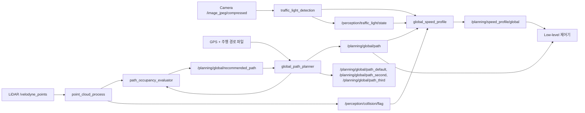

# 2025 HL FMA 자율주행 경진대회 모라이 시뮬레이션 부문

## 개요

이 저장소는 MORAI 시뮬레이터 기반 자율주행 프로젝트에서 제가 담당한 인지와 판단 모듈을 정리한 워크스페이스입니다.

제 담당 범위는 다음 세 가지 주행 기능에 집중되어 있습니다.

- LiDAR 기반 장애물 인지
- 신호등 인지
- GPS 기반 다중 차선 전역 경로 생성 및 장애물 회피, 신호 정지 판단

이 README는 제가 직접 맡은 패키지들을 포트폴리오 관점에서 설명하기 위한 문서입니다. Localization, dead reckoning, 저수준 제어는 별도 담당 영역이었기 때문에 여기서는 범위 밖으로 명확히 구분했습니다.

## 담당 범위

| 영역 | 패키지 | 구현한 내용 |
|---|---|---|
| Perception | [`Perception/point_cloud_process`](Perception/point_cloud_process/README.md) | LiDAR 전처리, 장애물 클러스터링, collision flag 생성, 전방 장애물 거리 모니터링 |
| Perception | [`Perception/traffic_light_detection`](Perception/traffic_light_detection/README.md) | 카메라 기반 신호등 상태 인지, 정지선 관련 보조 로직 |
| Decision | [`Decision/global_planner`](Decision/global_planner/README.md) | GPS 기반 다중 경로 발행, 경로 점유도 평가, 경로 전환, 속도 프로파일 생성 |

## 담당 범위 제외

아래 모듈들은 전체 차량 스택에는 포함되지만 제 담당 범위는 아니었습니다.

- `Perception/vehicle_localization`
- `Control/mpc_lateral_controller`
- `Control/mpc_longitudinal_controller`
- `Control/mpc_controller`
- `Control/pure_pursuit`
- `Control/gear_conversion`
- `Control/data_collection`
- `Control/lateral_system_identification`
- `Control/offline_analysis`

## 시스템 목표

이 시스템은 GPS 기반 주행 경로를 따라가면서 다음 동작을 수행하도록 설계되었습니다.

- 차선 수에 맞는 복수 개의 전역 후보 경로 발행
- LiDAR로 장애물을 인지하고 더 안전한 후보 경로 선택
- 신호등 상태를 인지하고 필요 시 정지선 전 정차
- 최종 선택된 경로와 목표 속도 프로파일을 하위 제어 스택에 전달

## End-To-End 파이프라인



## 주요 기능

### 1. LiDAR 기반 장애물 인지

- 전방 주행 시나리오에 맞춘 ROI 필터링
- 연산량 감소를 위한 선택적 voxel downsampling
- RANSAC 또는 grid 기반 지면 제거
- Euclidean clustering 및 중심점 병합
- 경고 및 긴급 정지 판단을 위한 collision zone 평가

### 2. 신호등 인지

- 압축 카메라 이미지를 사용하는 YOLO 기반 신호등 분류
- 표준화된 신호등 상태 토픽 발행
- 선택적 annotated debug image 발행
- 판단 계층에서 사용할 수 있는 신호 정지 연동 구조 제공

### 3. GPS 기반 다중 차선 경로 계획

- 활성 전역 경로와 복수 개의 후보 프리뷰 경로 발행
- 각 경로 corridor에 대해 장애물 점유도 평가
- 장애물 여유도에 따라 추천 경로 선택
- 곡률 기반 속도 프로파일 생성
- 신호등과 collision 조건에 따라 속도를 0으로 게이팅

## 패키지별 요약

### `Perception/point_cloud_process`

이 패키지는 원시 LiDAR 데이터를 실제 주행 판단에 사용할 수 있는 장애물 정보로 변환합니다.

- 입력: `/velodyne_points`
- 주요 출력:
  - `/perception/lidar/processed_points`
  - `/vis/perception/lidar/cluster_markers`
  - `/perception/collision/flag`
  - `/perception/obstacle/nearest_distance`


### `Perception/traffic_light_detection`

이 패키지는 카메라 이미지에서 신호등 상태를 인식하고, 판단 계층이 사용할 수 있는 결과를 발행합니다.

- 입력: `/image_jpeg/compressed`
- 주요 출력:
  - `/perception/traffic_light/state`
  - `/perception/traffic_light/annotated/compressed`
  - `/perception/traffic_light/stop_line/flag`
  - `/perception/traffic_light/stop_line/distance`


### `Decision/global_planner`

이 패키지는 제 담당 범위에서 판단의 중심 역할을 합니다. 다중 GPS 경로를 관리하고, 경로 점유도를 평가하며, 최종 속도 프로파일을 생성합니다.

- 주요 출력:
  - `/planning/global/path`
  - `/planning/global/path_default`
  - `/planning/global/path_second`
  - `/planning/global/path_third`
  - `/planning/global/recommended_path`
  - `/planning/speed_profile/global`


## 저장소 구조

```text
.
├── Decision
│   └── global_planner
├── Perception
│   ├── point_cloud_process
│   └── traffic_light_detection
└── Control
    └── ... Low-level 제어
```


## 기술 스택

- ROS1 Noetic
- MORAI Simulator
- Python
- PCL
- OpenCV
- YOLO

## 요약

이 프로젝트에서 저는 MORAI 시뮬레이터 기반 자율주행을 위해 필요한 인지 및 판단 로직을 담당했습니다.

- GPS 경로 생성
- LiDAR 기반 장애물 인지 및 장애물 회피
- 차선 단위 GPS 경로 생성
- 신호등 인지를 통한 정차 로직 생성
