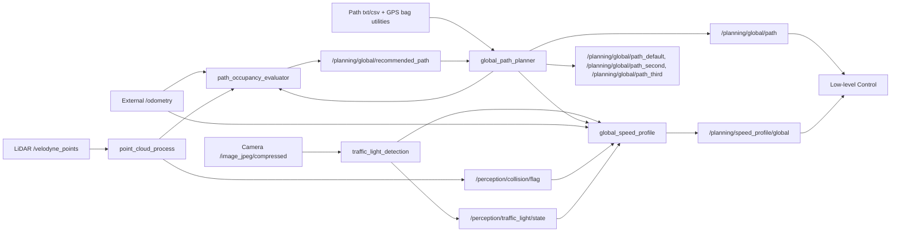

# 2025 HL FMA 자율주행 경진대회 모라이 시뮬레이션 부문

## 개요

이 저장소는 MORAI 시뮬레이터 기반 도심 자율주행 워크스페이스입니다. 전체 시스템은 Perception, Localization, Decision, Low-level Control 스택으로 구성됩니다.

- `Perception`: LiDAR 장애물 인지, 카메라 기반 신호등 인지, GPS/IMU 기반 차량 위치추정
- `Decision`: 공용 인터페이스 메시지, 전역 경로 발행, 경로 점유도 평가, 추천 경로 선택, 속도 프로파일 생성
- `Control`: 조향/종방향 제어기, MPC, 시스템 식별, 데이터 수집 및 분석

이 README 문서는 `개요`, `저장소 구조`를 제외하면 제가 담당한 파트만 설명합니다. 제가 맡은 Perception 범위는 `vehicle_localization`을 제외한 패키지입니다.

## 담당 범위

| 영역 | 패키지 | 구현한 내용 |
|---|---|---|
| Perception | [`Perception/point_cloud_process`](Perception/point_cloud_process) | LiDAR 전처리, ROI 필터링, 지면 제거, 장애물 클러스터링, collision flag 생성, 전방 장애물 거리 모니터링 |
| Perception | [`Perception/traffic_light_detection`](Perception/traffic_light_detection) | 카메라 기반 신호등 상태 인지, 정지선 관련 보조 로직 |
| Decision | [`Decision/global_planner`](Decision/global_planner) | 전역 경로 파일 변환 및 발행, 후보 경로 프리뷰 발행, 경로 점유도 평가, 추천 경로 선택, 곡률 기반 속도 프로파일 생성 |


## 담당 영역 목표

- LiDAR 데이터를 주행 판단에 사용할 수 있는 장애물 정보로 변환
- 카메라 Input에서 신호등 상태 추출
- 차선 단위 후보 전역 경로를 발행하고 점유도 기반으로 추천 경로 선택
- 곡률, 신호등 상태, collision 조건을 반영한 전역 속도 프로파일 생성

## 담당 파이프라인



## 주요 기능

### 1. LiDAR 기반 장애물 인지

- 전방 주행 시나리오에 맞춘 ROI 필터링
- 연산량 감소를 위한 voxel downsampling
- RANSAC 기반 지면 제거
- Euclidean clustering 및 중심점 병합
- collision zone 평가와 전방 장애물 거리 발행

### 2. 신호등 인지

- YOLO 기반 신호등 분류
- 신호등 상태 토픽 발행


### 3. 전역 경로 판단

- txt/rosbag 기반 전역 경로 데이터를 csv/ENU 형태로 변환
- 경로 corridor 점유도 평가 및 추천 경로 선택
- 추천 경로 추종 및 collision 이벤트 기반 경로 전환
- 곡률 기반 속도 프로파일 생성
- 신호등 상태와 collision 조건에 따른 속도 게이팅

## 패키지별 요약

### `Perception/point_cloud_process`

이 패키지는 Raw LiDAR 데이터를 장애물 판단에 사용할 수 있는 형태로 변환합니다.

- 입력:
  - `/velodyne_points`
- 주요 출력:
  - `/perception/lidar/processed_points`
  - `/perception/lidar/roi_points`
  - `/perception/lidar/nonground_points`
  - `/vis/perception/lidar/cluster_markers`
  - `/perception/collision/flag`
  - `/vis/perception/collision/debug_markers`
  - `/perception/obstacle/nearest_distance`

### `Perception/traffic_light_detection`

이 패키지는 카메라 이미지에서 신호등 상태를 인식하여 발행합니다.

- 입력:
  - `/image_jpeg/compressed`
  - `/planning/global/path`
  - `/odometry`
- 주요 출력:
  - `/perception/traffic_light/state`
  - `/perception/traffic_light/annotated/compressed`
  - `/perception/traffic_light/stop_line/flag`
  - `/perception/traffic_light/stop_line/distance`

### `Decision/global_planner`

이 패키지는 사전 제작한 ENU 경로를 로드해 후보 경로를 발행하고, 점유도 평가와 속도 플래닝을 수행합니다.

- 주요 입력:
  - 경로 파일(`txt`, `csv`)
  - `/odometry`
  - `/perception/lidar/processed_points`
  - `/perception/traffic_light/state`
  - `/perception/collision/flag`
- 주요 출력:
  - `/planning/global/path`
  - `/planning/global/path_default`
  - `/planning/global/path_second`
  - `/planning/global/path_third`
  - `/planning/global/recommended_path`
  - `/planning/global/path_occupancy`
  - `/planning/global/path_scores`
  - `/planning/global/current_idx`
  - `/planning/speed_profile/global`
  - `/vis/planning/global/path_corridors`

## 저장소 구조

```text
.
├── Perception
│   ├── point_cloud_process
│   ├── traffic_light_detection
│   └── vehicle_localization
├── Decision
│   ├── custom_interface
│   └── global_planner
└── Control
    ├── mpc_controller
    ├── mpc_lateral_controller
    ├── mpc_longitudinal_controller
    ├── pure_pursuit
    ├── gear_conversion
    ├── data_collection
    └── ...
```

## 기술 스택

- ROS1 Noetic
- MORAI Simulator
- PCL
- OpenCV
- PyTorch / Ultralytics YOLO
